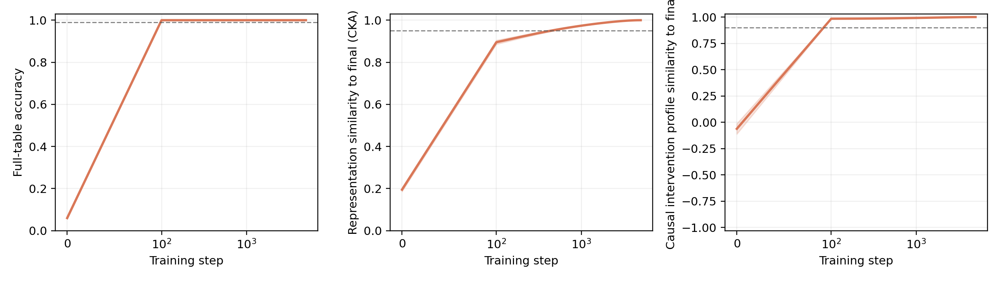
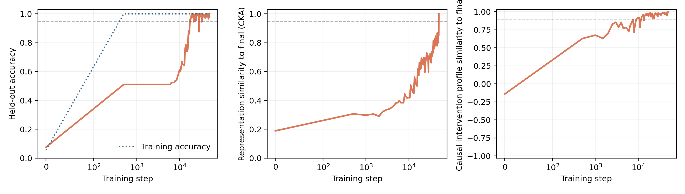

# Does behavior stabilize before mechanism?

A small causal interpretability study of learning dynamics in a transformer.

## Question

When a model reaches reliable task performance, has its internal causal mechanism
also stabilized?

This project contains two deliberately different modular addition experiments:

1. A **full-table control** trained on all 289 input pairs. This condition asks
   whether internal organization continues changing after exhaustive task mastery.
   It does not measure generalization.
2. A **held-out grokking condition** trained on 50% of the table with stronger
   weight decay. This condition asks whether causal and representational stability
   lead or lag delayed generalization.

At every checkpoint the code measures:

1. **Behavior**, using explicitly named full-table or held-out accuracy.
2. **Representation**, using centered kernel alignment with the final checkpoint.
3. **Causal mechanism**, using the loss increase caused by ablating each attention
   head and groups of MLP neurons, then comparing that causal importance profile
   with the final model.

The key comparison is the first checkpoint after which each measure never falls
below its prespecified threshold.

## Relation to prior grokking work

Delayed generalization on small algorithmic datasets was introduced by
[Power et al. (2022)](https://arxiv.org/abs/2201.02177). The modular addition
setting and the idea of tracking continuous mechanistic progress through
memorization, circuit formation, and cleanup follow
[Nanda et al. (2023)](https://arxiv.org/abs/2301.05217).

The full-table condition intentionally removes the training and held-out gap, and
therefore engineers away grokking. It is a non-grokking control, not a
generalization experiment. The second condition restores a 50/50 split and strong
weight decay to produce delayed held-out generalization. A 40% training pilot did
not grok within 70,000 steps; the nearby 50% split is reported rather than hiding
that negative pilot.

Attention head and grouped MLP ablations are interventions. They ask which components are necessary for the trained computation, not merely which activations correlate with the answer. Tracking these interventions through learning distinguishes a stable causal profile from a transient correlate.

## Run

```bash
python3 -m venv .venv
.venv/bin/pip install -r requirements.txt
.venv/bin/python experiment.py
```

Run the held-out grokking condition:

```bash
.venv/bin/python experiment.py --condition grokking \
  --train-fraction 0.5 --steps 50000 --seeds 0 \
  --learning-rate 0.0003 --weight-decay 1.0 \
  --checkpoint-every 500 --output grokking_50pct_results
```

A smoke test is available:

```bash
.venv/bin/python experiment.py --quick --output quick_results
```

Each run writes raw checkpoint metrics, intervention results, a summary, and
figures to its output directory.

Figures can be regenerated without retraining:

```bash
.venv/bin/python experiment.py --plot-only --output results
```

## Stability criteria

For the checkpoint and every checkpoint that follows:

- Full-table mastery: `full_table_accuracy` at least 0.99.
- Grokking behavior: `heldout_accuracy` at least 0.95.
- Representational stability: mean CKA to the final checkpoint at least 0.95.
- Causal stability: correlation of the complete intervention profile with the
  final checkpoint at least 0.90.

The full-table thresholds were declared before its final three-seed run. The 0.95
held-out threshold was selected after a pilot and is therefore exploratory, not
preregistered. The one-seed grokking result should be replicated before treating
the reported timing as a population estimate.

## Limitations

- Modular addition is a controlled algorithmic task, not language modeling.
- The full-table control addresses mastery, not generalization.
- The grokking result currently contains one seed and should be treated as a case
  study until replicated.
- Component ablation is coarse and can miss distributed or redundant mechanisms.
- Similar causal importance profiles do not prove identical algorithms.
- The final checkpoint is a practical reference, not ground truth.

<!-- The natural next step is activation patching on specific token positions, followed by analysis of whether the same causal subspace persists across seeds. -->

## Result

Across three seeds, accuracy on the complete truth table and the causal intervention profile were stable by step 100, the first checkpoint after initialization. Representational similarity reached its prespecified stability criterion later, at step 400 in one seed and step 500 in two seeds.

The result does not support the strongest initial hypothesis that component level causal importance continues reorganizing after behavioral mastery. Instead, it reveals a distinction between levels of internal organization: the allocation of causal importance across attention heads and MLP groups stabilizes early, while the geometry of the residual representation continues to consolidate.



In the held-out condition, training accuracy stabilized at step 500, the causal
profile stabilized at step 14,000, held-out accuracy remained above 95% from step
33,500 onward, and representation similarity continued changing through the
50,000-step endpoint.



See [RESULTS.md](RESULTS.md) for the concise report.
